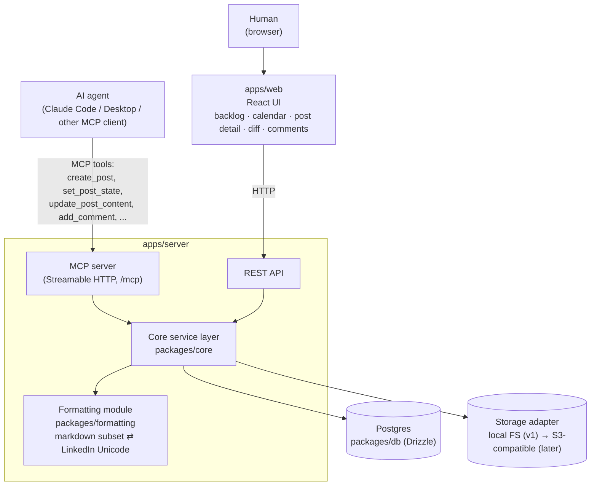
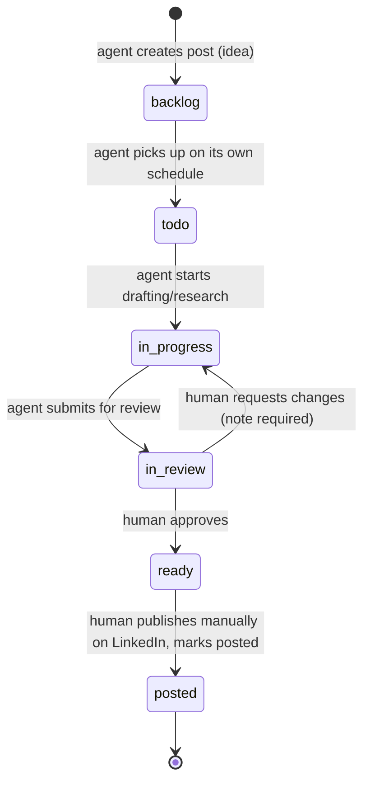
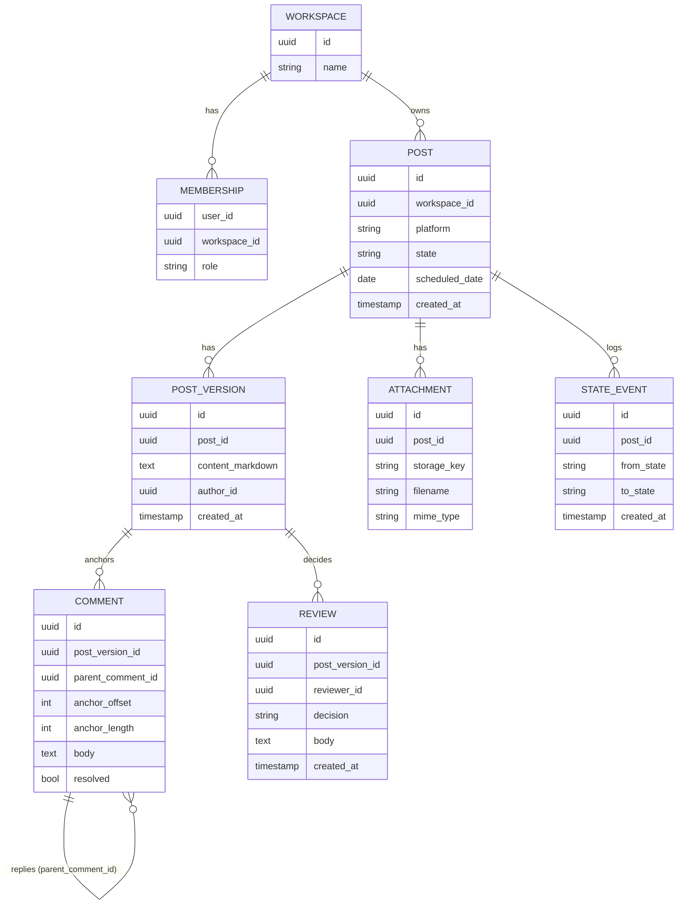

# Architecture Diagrams

Companion to [PLAN.md](./PLAN.md).

## System architecture

```mermaid
graph TD
    Agent["AI agent<br/>(Claude Code / Desktop / other MCP client)"]
    Human["Human<br/>(browser)"]

    subgraph apps/server
        MCP["MCP server<br/>(Streamable HTTP, /mcp)"]
        REST["REST API"]
        Core["Core service layer<br/>packages/core"]
        Fmt["Formatting module<br/>packages/formatting<br/>markdown subset ⇄ LinkedIn Unicode"]
    end

    Web["apps/web<br/>React UI<br/>backlog · calendar · post detail · diff · comments"]

    DB[("Postgres<br/>packages/db (Drizzle)")]
    Storage[("Storage adapter<br/>local FS (v1) → S3-compatible (later)")]

    Agent -->|"MCP tools:<br/>create_post, set_post_state,<br/>update_post_content, add_comment, ..."| MCP
    Human --> Web
    Web -->|HTTP| REST

    MCP --> Core
    REST --> Core
    Core --> Fmt
    Core --> DB
    Core --> Storage
```

## Post state machine

```mermaid
stateDiagram-v2
    [*] --> backlog: agent creates post (idea)
    backlog --> todo: agent picks up on its own schedule
    todo --> in_progress: agent starts drafting/research
    in_progress --> in_review: agent submits for review
    in_review --> ready: human approves
    in_review --> in_progress: human requests changes (note required)
    ready --> posted: human publishes manually on LinkedIn, marks posted
    posted --> [*]
```

## Data model (v1)

```mermaid
erDiagram
    WORKSPACE ||--o{ MEMBERSHIP : has
    WORKSPACE ||--o{ POST : owns
    POST ||--o{ POST_VERSION : has
    POST ||--o{ ATTACHMENT : has
    POST ||--o{ STATE_EVENT : logs
    POST_VERSION ||--o{ COMMENT : anchors
    POST_VERSION ||--o{ REVIEW : decides
    COMMENT ||--o{ COMMENT : "replies (parent_comment_id)"

    WORKSPACE {
        uuid id
        string name
    }
    MEMBERSHIP {
        uuid user_id
        uuid workspace_id
        string role
    }
    POST {
        uuid id
        uuid workspace_id
        string platform
        string state
        date scheduled_date
        timestamp created_at
    }
    POST_VERSION {
        uuid id
        uuid post_id
        text content_markdown
        uuid author_id
        timestamp created_at
    }
    COMMENT {
        uuid id
        uuid post_version_id
        uuid parent_comment_id
        int anchor_offset
        int anchor_length
        text body
        bool resolved
    }
    REVIEW {
        uuid id
        uuid post_version_id
        uuid reviewer_id
        string decision
        text body
        timestamp created_at
    }
    ATTACHMENT {
        uuid id
        uuid post_id
        string storage_key
        string filename
        string mime_type
    }
    STATE_EVENT {
        uuid id
        uuid post_id
        string from_state
        string to_state
        timestamp created_at
    }
```
